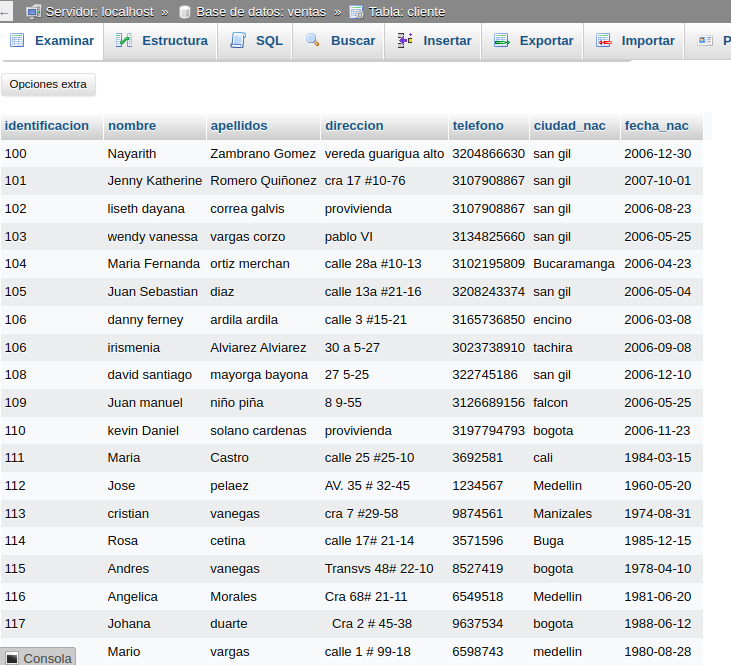
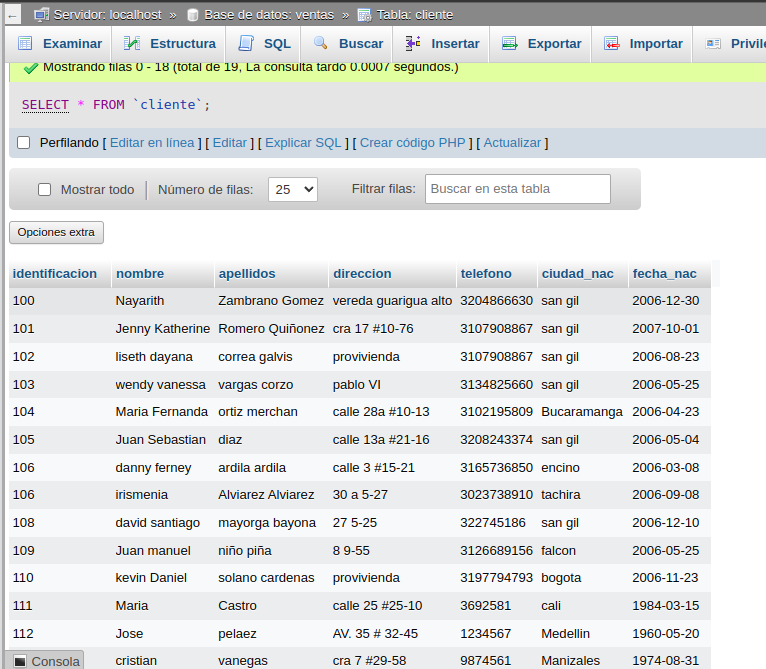
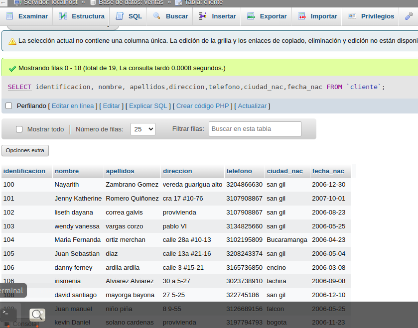
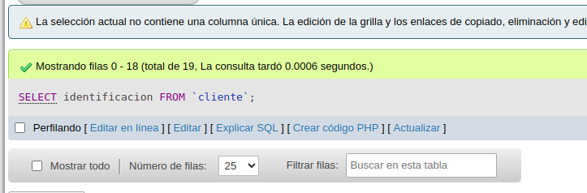
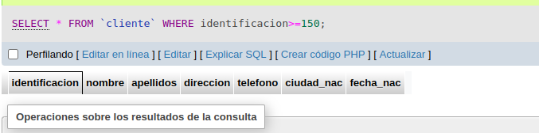
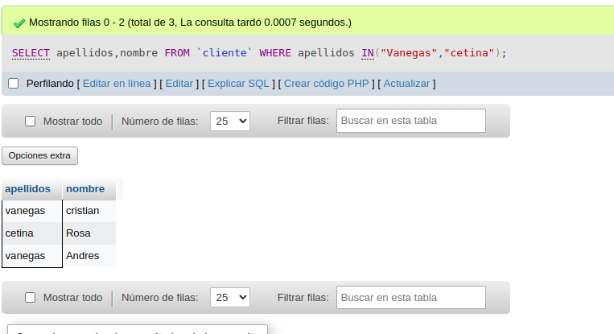
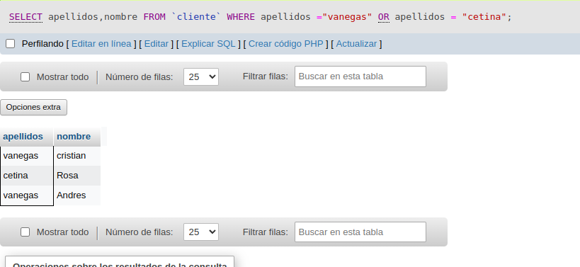
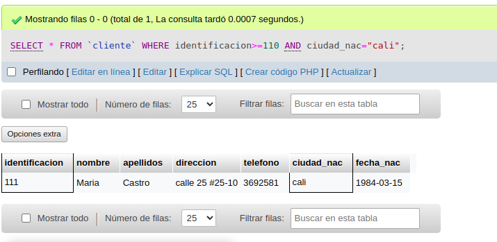
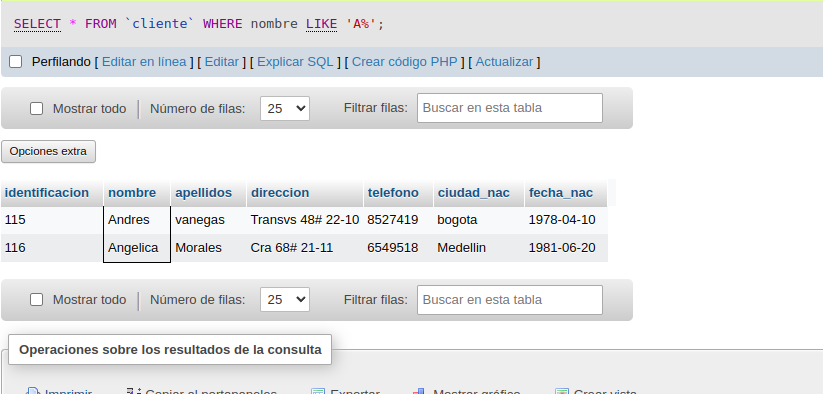
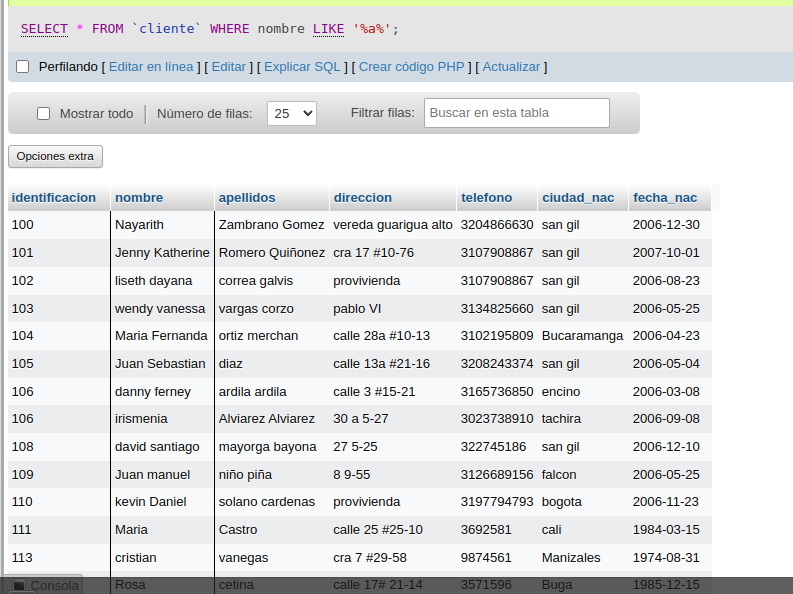

# consultas_1_sql
 # introducción a las consultas a una BD usando el lenguaje SQL

## Base de datos: Ventas
## Tabla: Cliente

## Instrucciones SELECT
- Permite seleccionar datos de una tabla.
- Su formato es: `SELECT campos_tablas FROM
nombre_tabla``

### Consultas No. 1
1. Para visualizar toda la informacion que contiene la tabla Cliente se puede incluir con la instruccion SELECT el caracter **\*** o cada uno de los campos de la tabla.

- `SELECT * FROM Cliente`

- `SELECT identificacion, nombre, apellidos, direccion, telefono,ciudad_nac, fecha_nac FROM Cliente`

### Consultas No. 2
2. para  visualizar solamente la identificacion del cliente: `SELECT identificacion FROM cliente`

### Consultas No. 3
3. Si se desea obtener los registros cuya identificacion sea mayor o igual a 150, se debe utilizar la clausula `WHERE` que especifica las condiciones que deben reunir los registros que se van a seleccionar: `SELECT * FROM cliente WHERE identificacion>=150`

### Consulta No. 4

4. Se desea obtener los registros cuyos apellidos seana Vanegas o Cetina, se debe utilizar el operador `IN` que especifica los registros que se quieren visualizar de una tabla.

`SELECT apellidos, nombre FROM Clientes WHERE apellidos IN ('Vanegas','Cetina')`

o se puede utilizar el operador `OR`

`SELECT apellidos,nombre FROM Clientes WHERE apellidos = 'Vanegas' OR apellidos = 'Cetina'`

### Consulta No. 5

5. Se desea obtener los registros cuya identificacion sea menor de 110 y la ciudad sea cali, se debe utlizar el operador `AND`

`SELECT * FROM Cliente WHERE identificacion<=110 AND ciudad_nac = 'Cali'`

### Consulta No. 6

6. si se desea obtener los registros cuyos nombres enpiecen por la letra "A" se debe utilizar el operador `LIKE` que utiliza los patrones `%`(todos) y `_`(caracter).
`SELECT * FROM Cliente WHERE nombre LIKE A%`

### Consulta No. 7

7. se desea obtener los registros cuyos nombres contengan la letra "a"
`SELECT * FROM Cliente WHERE nombre LIKE %a%`

### Consulta No. 8

8. se desea obtener